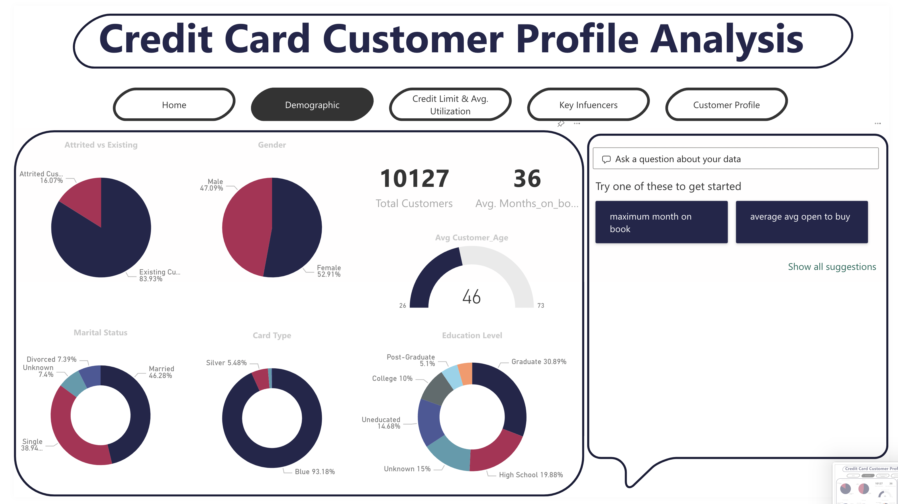
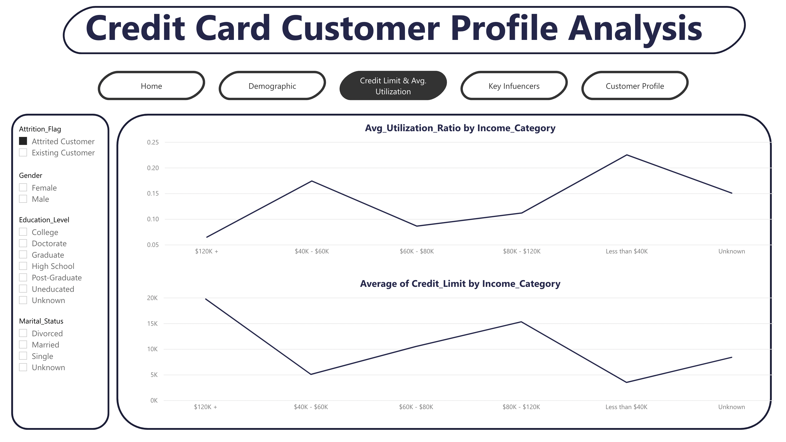
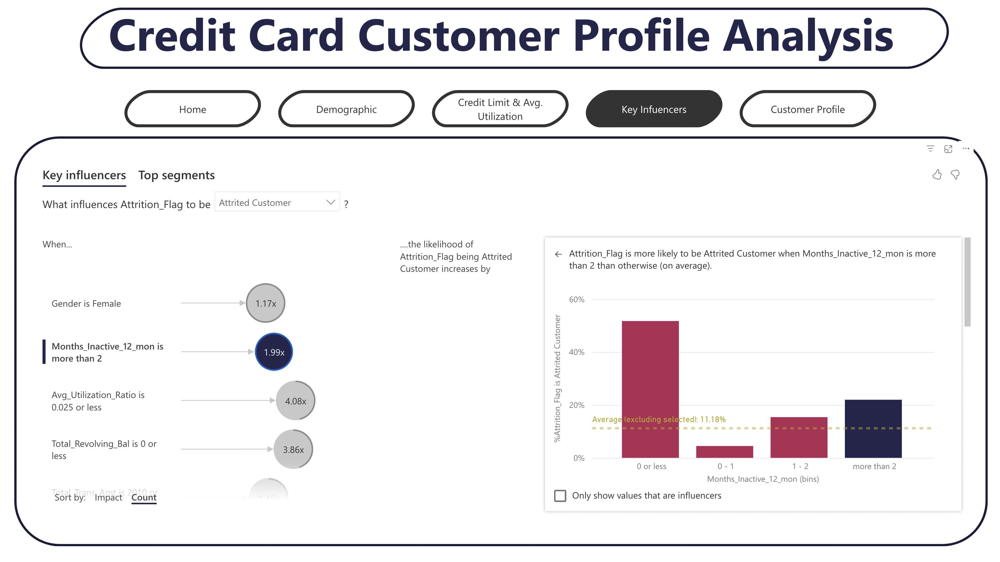
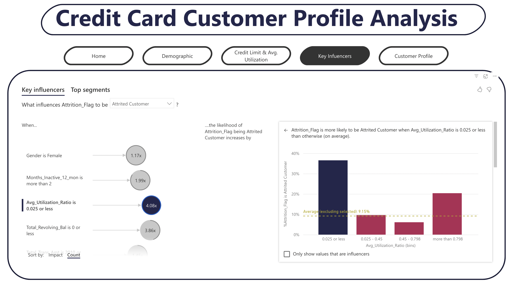
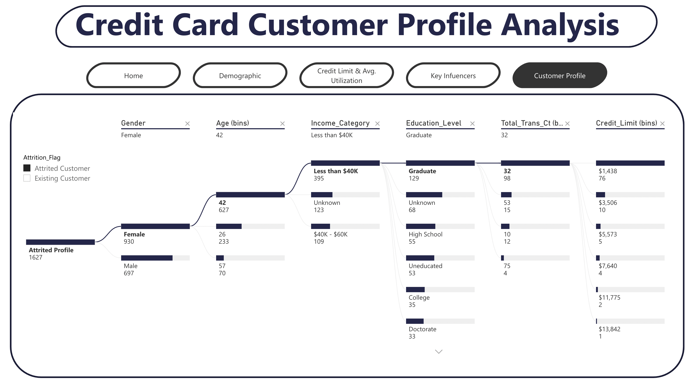

# Adhoc Report on Power BI: Attrited Customer Profile Analysis

***

## Introduction

A manager at the bank is disturbed with more and more customers leaving their credit card services. They would really appreciate if one could predict for them who is gonna get churned so they can proactively go to the customer to provide them better services and turn customers' decisions in the opposite direction.

The aim of this project is to exhibit my skills in analyzing and visualizing credit card data with user friendly navigation using Power BI.

The Report consists of five pages:

-  Home 
-  Demographic
-  Avg. Utilization vs Credit limit
-  Key Influencers
-  Customer Profile

## Data Source 
I have used the data available at Kaggle website (_[Credit Card customers dataset, 2021](https://www.kaggle.com/datasets/sakshigoyal7/credit-card-customers)_). The dataset fulfils the requirements for the project and is in the CSV format. 

## Data Description 
This dataset consists of 10,000 customers mentioning their age, salary, marital_status, credit card limit, credit card category, etc. There are nearly 18 features. 
-   CLIENTNUM: Client number. Unique identifier for the customer holding the account
-   Attrition_Flag: Internal event (customer activity) variable - if the account is closed then Attrited Customer else Existing Customer
-   Customer_Age: Demographic variable - Customer's Age in Years
-   Gender: Demographic variable - M=Male, F=Female
-   Dependent_count: Demographic variable - Number of dependents
-   Education_Level: Demographic variable - Educational Qualification of the account holder (example: high school, college graduate, etc.)
-   Marital_Status: Demographic variable - Married, Single, Divorced, Unknown
-   Income_Category: Demographic variable - Annual Income Category of the account holder (< $40K, $40K - 60K, $60K - $80K, $80K-$120K, > $120K, Unknown)
-   Card_Category: Product Variable - Type of Card (Blue, Silver, Gold, Platinum)
-   Months_on_book: Period of relationship with bank
-   Total_Relationship_Count: Total no. of products held by the customer
-   Months_Inactive_12_mon: No. of months inactive in the last 12 months
-   Credit_Limit: Credit Limit on the Credit Card
-   Total_Revolving_Bal: Total Revolving Balance on the Credit Card
-   Avg_Open_To_Buy: Open to Buy Credit Line (Average of last 12 months)
-   Total_Trans_Amt: Total Transaction Amount (Last 12 months)
-   Total_Trans_Ct: Total Transaction Count (Last 12 months)
-   Avg_Utilization_Ratio: Average Card Utilization Ratio

## Problem Statement

A business manager of a consumer credit card portfolio is facing the problem of customer attrition. They want to analyze the data to find out the reason behind this and leverage the same to predict customers who are likely to drop off.

   

## Analysis and Visualization

It appears that there are more positive reviews than negative ones, however the dataset does not follow the normal data trend. 
In support of our hypothesis based on Table 1, Table 2 shows the supporting data.

***
