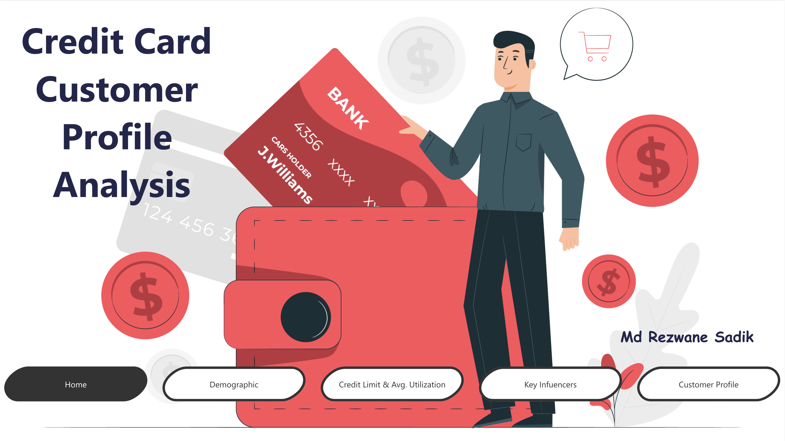

# Adhoc Report on Power BI: Attrited Customer Profile Analysis

***

## Introduction

A manager at the bank is disturbed with more and more customers leaving their credit card services. They would really appreciate if one could predict for them who is gonna get churned so they can proactively go to the customer to provide them better services and turn customers' decisions in the opposite direction

I got this dataset from a website with the URL as https://leaps.analyttica.com/home. I have been using this for a while to get datasets and accordingly work on them to produce fruitful results. The site explains how to solve a particular business problem.

Now, this dataset consists of 10,000 customers mentioning their age, salary, marital_status, credit card limit, credit card category, etc. There are nearly 18 features.

We have only 16.07% of customers who have churned. Thus, it's a bit difficult to train our model to predict churning customers.

Instagram is one of the most popular social media platforms in the world, with millions of active users sharing photos, videos, and comments every day. By analyzing the data in these CSV files, we can gain insights into how people use Instagram and how they interact with each other.

Instagram Analytics project is an exciting opportunity to work with data related to one of the most popular social media platforms in the world. By applying our knowledge of __SQL__ and data analysis, we can gain insights into user behavior on Instagram and help businesses and individuals to achieve greater success on the platform.

The aim of this project is to exhibit my data cleaning on __python__ and buliding __SQL__ queries skills on _Instagram User Behaviour_ dataset. 

(_[PowerBI dashboard, 2023](https://app.powerbi.com/reportEmbed?reportId=a9d2585a-edc4-4ef7-88d0-ba161078456d&autoAuth=true&ctid=9c36a7d0-bf7b-4991-9b78-be91a52f0226)_)

## Data Source 
I have used the data available at Kaggle website (_[Credit Card customers dataset, 2021](https://www.kaggle.com/datasets/sakshigoyal7/credit-card-customers)_). The dataset fulfils the requirements for the project and is in the CSV format.

## Problem Statement

The project issues are divided into 2 modules. 

__#Module 1:__ Data Pre-processing on **Python**.

1.  Data cleaning by removing unwanted columns and renaming appropriate columns for improved analysis 
    - comments
    - follows
    - likes
    - photos
    - photo_tags
    - tags
    - users
 2. Generating tables using the cleaned dataset
   
__#Module 2:__ Data Analysing using **SQL**.

1. Find the 5 oldest users.
2. What day of the week do most users register on?
3. To target our inactive users with an email campaign. Find the users who have never posted a photo.
4. Who won the new contest to see who can get the most likes on a single photo?
5. How many times does the average user post? 
6. What is the user ranking by postings higher to lower?
7. Total posts by users.
8. Total numbers of users who have posted at least one time
9. A brand wants to know which hashtags to use in a post. What are the top 5 most commonly used hashtags?
10. We have a small problem with bots on our site. Find users who have liked every single photo on the site?
11. We also have a problem with celebrities. Find users who have never commented on a photo?
12. Are we overrun with bots and celebrity accounts? Find the percentage of our users who have either never commented on a photo or have commented on every photo?
13. Find users who have ever commented on a photo?
14. Are we overrun with bots and celebrity accounts? Find the percentage of our users who have either never commented on a photo or have commented on photos before.

## Data Analysis Concepts/Skills Demonstrated 

1. __Data cleaning:__ _It involves identifying and removing irrelevant or redundant columns and renaming the columns to make them more descriptive and consistent with the content of the dataset. This improves the quality and usability of the data for analysis and modeling purposes._
2. __MySQL Database:__ _Utilize the MySQL database to manually create the tables for the cleaned dataset_
3. __SQL Queries:__ _It involves writing queries for the dataset using SQL to gain insights from the database. Different concepts of SQL has been used in this process, such as_
    - aggregating the data, 
    - grouping the data, 
    - ordering the data,
    - joining the tables
    - sub queries etc

***
